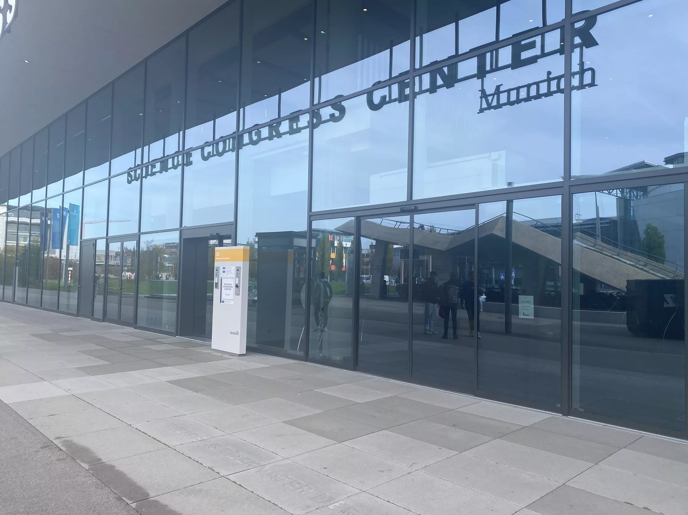

# Workshop on Deep reinforcement learning for infrastructure maintenance planning: Trends, opportunities and challenges

[Home](index.md) > Workshop

---

Organized by [Daniel Straub](https://www.cee.ed.tum.de/era/team/daniel-straub/) and [Kostas Papakonstaninou](https://sites.psu.edu/kpapakon/)
at the [TUM Georg Nemetschek Institute - Artificial Intelligence for the Built World](https://www.mdsi.tum.de/en/gni/home/)

## Abstract

Deep reinforcement learning (DRL) has shown a large potential to enable efficient planning of operation and maintenance of engineering systems. Recent works have shown that the approach is potentially applicable to systems of a considerable size and complexity.  
 
In this workshop, we want to review the current state of the art and - in particular- discuss the open questions that should be addressed to enable real-life application of DRL for infrastructure management. The first part of the workshop includes talks by selected experts to provide an overview on the current state of the art in research as well as the industry perspective, which leads over to a joint discussion on the current capabilities and limits of methods and the requirements by industry. The second part of the workshop starts with presentations by PhD students that lead into a discussion on the most relevant and pressing research questions.

## Date and Location

[12.05.2023, 10:00 - 17:00 CEST](https://www.timeanddate.com/worldclock/fixedtime.html?msg=Workshop+Deep+reinforcement+learning+for+infrastructure+maintenance+planning%3A+Trends%2C+opportunities+and+challenges&iso=20230512T10&p1=168&ah=7)

This workshop will be held in hybrid (online and in person).

Online attendance via Zoom. The link will be sent to you via email.

The in person event will be held at the [GNI at TUM Campus Garching](https://www.mdsi.tum.de/gni/getting-to-gni/). [[Directions]](#directions-for-in-person-attendance)

Please confirm your participation via [Eventbrite](https://www.eventbrite.de/e/workshop-deep-reinforcement-learning-for-infrastructure-maintenance-plannig-tickets-621786890327). 

## Agenda

| Time              |     |
| ----------------- | --- |
| 10:00             | **Welcome** |
| 10:05 - 10:30     | **Presentation Kostas Papakonstantinou**  Multi-agent deep reinforcement learning for infrastructure management: Recent advances and future challenges| 
| 10:35 - 11:00     | **Presentation Olga Fink**  Safe multi-agent deep reinforcement learning for joint bidding and maintenance scheduling of generation units | 
| 11:05 - 11:30     | **Presentation Tobias Zeh**  AI-based asset management strategy - A practical approach |
| 11:30 - 12:00     | **Discussion on opportunities and challenges** |
| 12:00 - 14:00     | **Lunch break** |
| 14:00 - 16:00     | **PhD presentations incl. discussions:**     **Prateek Bhustali**: Multiagent decision-making for scalable inspection & maintenance planning of deteriorating systems.   **Arcieri Giacomo**: POMDP inference and robust solution via deep reinforcement learning: An application to railway optimal maintenance   **Daniel Hettegger**: Investigation of Inspection and Maintenance Optimization with Deep Reinforcement Learning in Absence of Belief States   **Dongkyu Lee**: Operation and Maintenance Planning for Lifeline Networks Using Parallelized Multi-agent Deep Q-Network.   **Mohammad Saif**: Multi-Agent Deep Reinforcement Learning (MARL) for optimal decision-making for transportation systems and Value of Information Implications for MARL. |
| 16:00 - 16:15     | **Poll on the most interesting / relevant research question** |
| 16:15 - 16:45     | **Discussion “What are the key research questions?”** |
| 16:45 - 17:00     | **Closure** | 

## Speakers

| Kostas Papakonstantinou |[ Penn State, Civil and Environmental Engineering Department](https://sites.psu.edu/kpapakon/)|
| Olga Fink | [EPFL, Intelligent Maintenance and Operations Systems](https://people.epfl.ch/olga.fink?lang=en)|
| Tobias Zeh | Netze BW GmbH|

## Directions for in person attendance

The TUM GNI is located at:

Walther-von-Dyck-Straße 10  
(GALILEO Garching)  
85748 Garching near Munich  

### Arrival by public transport

The Galileo building is located at the campus of the Technische Universität München in Garching.

- Take the subway (line U6) to the subway station Garching Forschungszentrum (about 25 minutes from Munich city centre).
- Exit the station using the northern most exit (at the front end of the train).
- Turn right towards the Galileo building.
- Enter the building using the door indicated in the Image below and take the elevator to the 4th Floor.
- The entrance to the TUM GNI is on the left after exiting the elevator.

 
### Arrival by car

You can see on [Google Maps](https://www.google.com/maps?rls=en&q=Walther-von-Dyck-Stra%C3%9Fe+10+(GALILEO+Garching)+85748+Garching+near+Munich) how to get to us by car. There is an underground car park in the GALILEO building or you can use the Park & Ride Garching Forschungszentrum.
